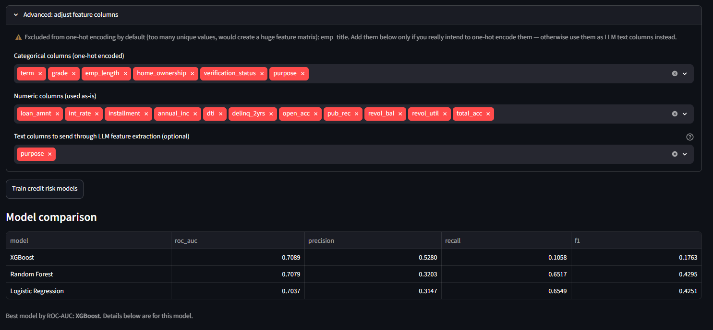
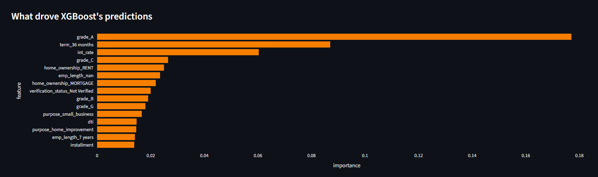
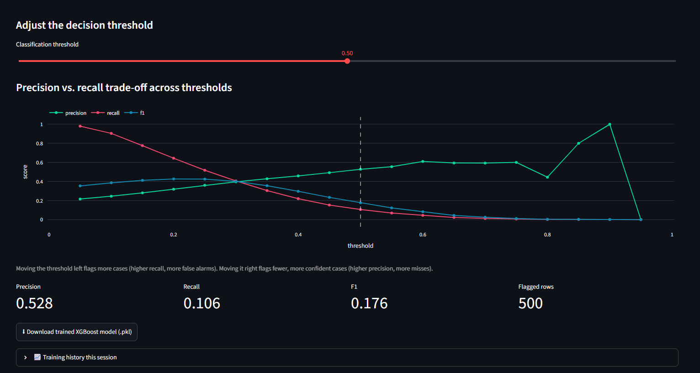
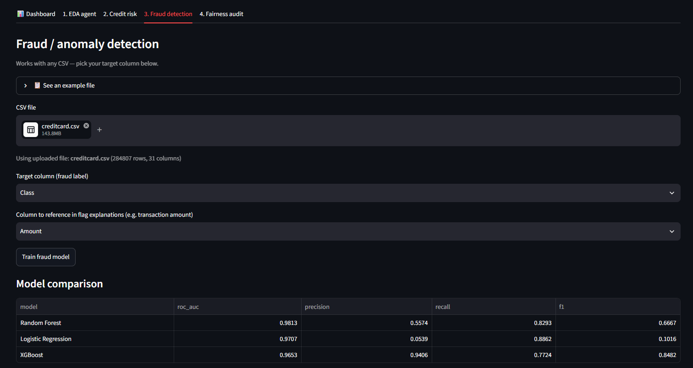
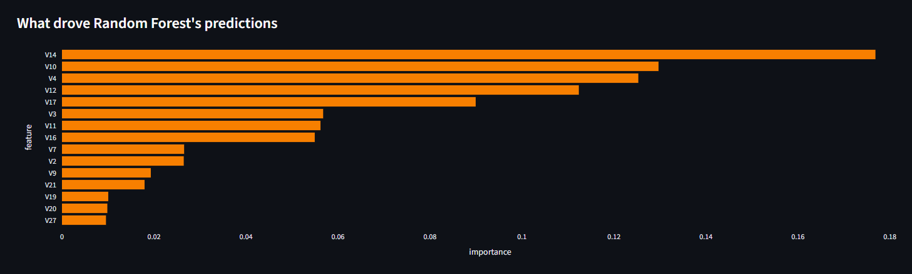
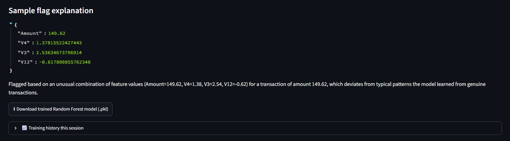
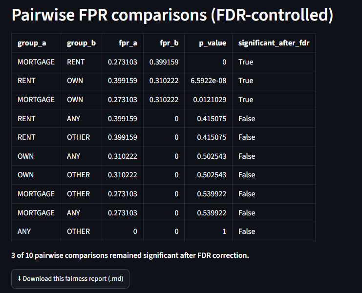
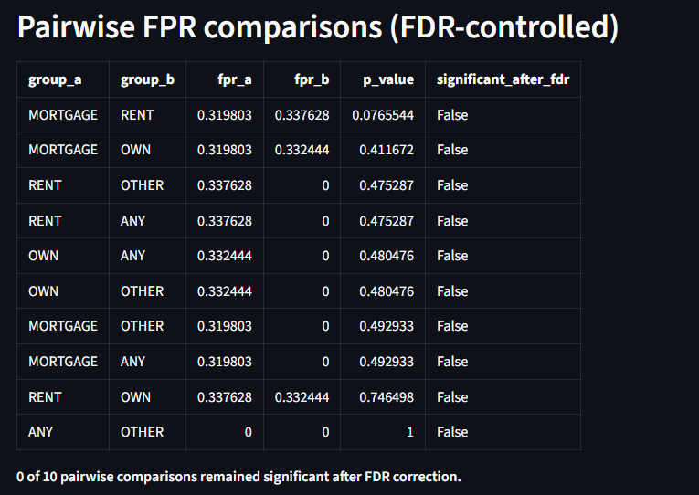

# Responsible Credit & Fraud Risk Platform

An end-to-end system that combines **agentic AI**, **machine learning**, and **data science** into a single deployed application for credit risk scoring, fraud detection, and fairness auditing — trained and validated on real LendingClub and credit card fraud data, not just synthetic samples.

> **Live:** [responsible-credit-fraud-risk-platform.streamlit.app](https://responsible-credit-fraud-risk-platform.streamlit.app/)


https://github.com/user-attachments/assets/e85b916d-d4c0-4e27-9166-a4756d01422c


---

## What this project does

Given a lending or transactions dataset, the platform:

1. **Visualizes it instantly** on a no-code-required Dashboard tab — shape, target balance, distributions, and correlations as charts, understandable without any ML background.
2. **Profiles the data automatically** using a Claude-powered agent that plans and runs its own exploratory analysis (with a full-featured non-LLM fallback view).
3. **Scores credit risk** by training and comparing three models (Logistic Regression, Random Forest, XGBoost) on structured features plus features extracted from unstructured text via the Claude API.
4. **Flags fraudulent transactions**, with each flag accompanied by a plain-English explanation.
5. **Audits every model for fairness**, computing subgroup false-positive/false-negative rates with statistically controlled significance testing — and, critically, testing whether a disparity survives removing the protected attribute from the model's inputs entirely.

Every tab works on **any uploaded CSV**, not just the built-in samples — you pick the target column, the feature columns, and (optionally) which text columns get sent through LLM-based feature extraction.

## Why this project exists

Most student ML projects are a single notebook that trains one model on one dataset. This project is instead built to demonstrate:

- A **multi-module system** with shared components, not copy-pasted code across separate scripts
- An **LLM used as a functional pipeline component** (feature extraction, agentic analysis, explanation generation), not a novelty chatbot bolted on top
- **Responsible-AI practices** (fairness auditing, with a genuine methodology behind it) as a first-class part of the pipeline
- Results validated on **real data**, with real, sometimes messy, sometimes inconvenient findings — including bugs the real data exposed that synthetic data never would have

## Where this sits across AI, ML, and DS

| Domain | What lives here |
|---|---|
| **Artificial Intelligence** | The EDA agent (Claude + tool use planning its own analysis), the LLM-based text-to-feature extractor, the natural-language fraud-flag explainer |
| **Machine Learning** | Credit risk and fraud classifiers (Logistic Regression, Random Forest, XGBoost), trained and compared with proper held-out evaluation |
| **Data Science** | Exploratory profiling, the fairness audit (subgroup rate testing, FDR-controlled significance), and the visual reporting layer |

Full breakdown, module by module, in [`docs/domain_mapping.md`](docs/domain_mapping.md).

## Architecture

```
                    ┌─────────────────────────────────┐
                    │         Data layer              │
                    │  any uploaded CSV, or the       │
                    │  built-in lending/fraud samples │
                    └───────────────┬─────────────────┘
                                    ▼
        ┌───────────────────────────────────────────────────┐
        │                    Streamlit app (app.py)         │
        │  ┌───────────┬───────────┬───────────┬───────────┐│
        │  │ Dashboard │ EDA agent │ Credit    │ Fraud     ││
        │  │  (charts)  │ (profile)│ risk      │ detection ││
        │  └───────────┴───────────┴───────────┴───────────┘│
        │              ┌───────────┐                        │
        │              │ Fairness   │                       │
        │              │ audit      │                       │
        │              └───────────┘                        │
        └───────┬──────────────┬──────────────┬─────────────┘
                ▼              ▼              ▼
    ┌─────────────────┐  ┌─────────────────┐  ┌─────────────────┐
    │  agent/         │  │  credit_risk/   │  │  fraud/         │
    │  profiler.py    │  │  features.py    │  │  model.py       │
    │  claude_agent.py│  │  llm_features.py│  │  explain.py     │
    │  dashboard.py   │  │  train.py       │  │                 │
    │  render.py      │  │                 │  │                 │
    └───────┬─────────┘  └───────┬─────────┘  └───────┬─────────┘
            │                   │                   │
            └───────────┬───────┴───────────┬───────┘
                        ▼                   ▼
            ┌─────────────────────┐   ┌───────────────────┐
            │  shared/            │   │  fairness/        │
            │  llm_client.py      │   │  audit.py         │
            │  model_utils.py     │   │  (subgroup rates +│
            │  (train_and_compare,│   │   FDR-controlled  │
            │   guess_target_col, │   │   significance)   │
            │   feature importance│   └───────────────────┘
            │   thresholds)       │
            └─────────────────────┘
                        │
                        ▼
              Deployed on Streamlit
                 Community Cloud
```

**Key design decision:** `shared/model_utils.py` and `shared/llm_client.py` are what make this one platform instead of four disconnected scripts — the credit risk and fraud tabs both call the same `train_and_compare` (same three models, same balanced training, same held-out evaluation), and every LLM-powered module goes through the same client with the same fallback behavior when no API key is set.

## A note on the LLM features

The deployed demo runs **without an `ANTHROPIC_API_KEY` set, by design** — this is a public, unauthenticated app that anyone can hit repeatedly, and enabling a paid API key on it would mean unbounded cost exposure with no rate limiting on the demo side. Every LLM-powered feature (the EDA agent's summary, the credit risk LLM feature extractor, the fraud flag explanations) is built with a deterministic fallback specifically so the app stays fully usable — every tab, every chart, every model — with zero API cost. This was a deliberate engineering trade-off, not an unfinished piece: a production deployment with authenticated users and usage limits would be the natural place to enable the live key.

---

## Results

All results below are from the **real, full-size datasets** — a 50,000-row stratified sample of resolved loans from LendingClub's actual accepted-loans dataset (2.26M rows total, 1.34M resolved), and the real `mlg-ulb/creditcardfraud` dataset (284,807 real transactions) — not the synthetic samples used for early development.

### Credit risk

Trained on 50,000 resolved LendingClub loans (40,019 Fully Paid, 9,981 Charged Off — a ~20% default rate matching the real-world figure). Features: all 18 structured fields plus `purpose` through the LLM extractor (in fallback mode, per the note above). `emp_title` was excluded from one-hot encoding by design — see [Engineering challenges](#engineering-challenges-the-real-data-surfaced) below.



| Model | ROC-AUC | Precision | Recall | F1 |
|---|---|---|---|---|
| XGBoost | 0.7089 | 0.528 | 0.106 | 0.176 |
| Random Forest | 0.7079 | 0.320 | 0.652 | 0.430 |
| Logistic Regression | 0.7037 | 0.315 | 0.655 | 0.425 |

**The model with the best ROC-AUC is not automatically the best model to deploy.** All three land within 0.005 of each other on ROC-AUC, but at the default 0.5 threshold they behave very differently — XGBoost is precise but catches only 10.6% of actual defaults, while the other two catch 65% at the cost of more false positives. Which one is "better" depends entirely on the real-world cost of a missed default vs. a wrongly-flagged good borrower, not on a single leaderboard number.

> **Known caveat on this specific table:** this run was captured before a bug was found and fixed in XGBoost's class-balancing (see below) — XGBoost's precision/recall trade-off shown here is likely understated relative to a rerun with the fix applied. The ROC-AUC ranking and the overall "best AUC ≠ best deployment choice" finding both still hold; the exact XGBoost recall number is the part that's stale.



Top features (`grade_A`, loan term, interest rate) line up with how LendingClub's own internal grading system is designed — a good sanity check that the model learned a real signal, not noise.



The threshold slider makes the precision/recall trade-off adjustable live, instead of locking in the default 0.5 cutoff.

### Fraud detection

Trained on the real, full 284,807-row creditcardfraud dataset (492 fraudulent transactions, ~0.17% — highly imbalanced, as real fraud data always is).



| Model | ROC-AUC | Precision | Recall | F1 |
|---|---|---|---|---|
| Random Forest | 0.9813 | 0.557 | 0.829 | 0.667 |
| Logistic Regression | 0.9707 | 0.054 | 0.886 | 0.102 |
| XGBoost | 0.9653 | 0.941 | 0.772 | 0.848 |

**The same "best AUC ≠ best model" pattern shows up here, even more starkly.** Random Forest wins on raw ROC-AUC, but Logistic Regression — despite a strong-looking 0.9707 AUC — has precision of just 5.4%: over 94% of everything it flags is a false alarm. XGBoost, ranked *third* on AUC, is the clear practical winner by F1 (0.848): a fraud team reviewing every flagged transaction would want XGBoost's 94% precision, not a model that buries them in false positives despite its impressive AUC.



Top features (V14, V10, V4, V12) match commonly-cited top predictors in public research on this exact dataset — another real-data sanity check.



The fallback flag explanation working correctly on real transaction data (LLM-powered version available once a key is configured).

### Fairness audit — a two-step test, not a single number

The audit was run twice on the same real credit risk data and model, testing whether a fairness disparity was direct or hidden.

**Step 1 — `home_ownership` included as a model input feature:**



A real, substantial gap: false-positive rates ranged from 27.3% (Mortgage) to 39.9% (Rent), and **3 of 10 pairwise subgroup comparisons remained statistically significant** after FDR correction.

**Step 2 — `home_ownership` removed from the model's inputs, audited only afterward:**



With the model never given direct access to `home_ownership`, the FPR gap collapsed to 32.0%–33.8%, and **0 of 10 pairwise comparisons remained significant.**

**Why this two-step test matters:** the first result alone would be a weak finding — a model given a feature directly is expected to use it, so "errors correlate with a feature the model was fed" isn't surprising. The real question for a fairness audit is whether the model develops that same disparity *indirectly*, through other features that happen to correlate with the protected attribute (income, loan grade, etc.) — that's the textbook definition of proxy discrimination. Here, the disparity disappeared almost entirely once direct access was removed, which is genuinely good news: it means the original gap was explained by direct feature use, not a hidden bias baked in through correlated features.

---

## Engineering challenges the real data surfaced

Real data broke things synthetic data never would have. Documenting these honestly, because finding and fixing them is a bigger signal of engineering ability than a clean first run would have been:

- **A high-cardinality crash.** The real `emp_title` field has ~20,000+ unique free-text job titles at this sample size. One-hot encoding it by default would have created a matrix large enough to crash the deployed app outright. Fixed with an automatic cardinality check (columns with >50 unique values default out of one-hot encoding and into the LLM-text-extraction path instead) plus a hard safety cap as a backstop.
- **A silent XGBoost class-imbalance bug.** `class_weight="balanced"` was applied to Logistic Regression and Random Forest, but XGBoost has no such parameter — it needs `scale_pos_weight` instead, which was initially missed. This meant XGBoost trained fully unweighted on ~80/20 imbalanced data, producing a good-looking ROC-AUC while actually being nearly blind to the minority class (recall as low as ~10% in the credit risk run above, and 85–96% false-negative rates in an early fairness audit run). Fixed by computing `scale_pos_weight` from the actual training split.
- **A pandas `groupby().apply()` footgun.** Stratified sampling for the real-data cleaning script silently dropped the grouping column when the returned frame still contained it unchanged — a genuine, easy-to-miss pandas behavior. Fixed by switching to `groupby().sample()`.
- **A PyArrow mixed-type crash.** A schema-preview table mixed an integer and a string value in the same display column; Streamlit's Arrow-based renderer inferred a single type from the first value and crashed on the first mismatch. Fixed by forcing display-only columns to strings.
- **A Streamlit state bug.** Moving the classification-threshold slider appeared to "reset" all training results — because `st.button()` only returns `True` on the exact run right after being clicked, and the results were rendered inside that same conditional block. Fixed by persisting trained results in `st.session_state` and rendering them independently of the button state.

## Running locally

```bash
git clone https://github.com/<your-username>/risk-platform.git
cd risk-platform
python3 -m venv venv && source venv/bin/activate   # Windows: venv\Scripts\activate
pip install -r requirements.txt
streamlit run app.py
```

Set an API key first if you want the live LLM-powered modules instead of fallback mode:

```bash
export ANTHROPIC_API_KEY="sk-ant-..."   # Windows: set ANTHROPIC_API_KEY=sk-ant-...
```

Get a key at [console.anthropic.com](https://console.anthropic.com) under **Settings → API Keys**.

### Getting the real datasets

```bash
pip install kagglehub
python data/download_data.py
python credit_risk/prepare_real_data.py --input data/full/credit_risk/<file>.csv --output data/full/credit_risk_real_clean.csv --sample-size 50000
```

See [`data/README.md`](data/README.md) for full details on dataset sourcing and why raw datasets aren't committed to this repo.

### Running the test suite

```bash
pip install -r requirements-dev.txt
pytest
```

53 tests covering feature engineering, model comparison, fairness statistics, and the profiler — including regression tests for the bugs listed above, so they can't silently reappear.

## Repo structure

```
risk-platform/
├── data/
│   ├── samples/              # small synthetic samples, checked into git
│   ├── full/                 # real downloaded datasets, gitignored
│   ├── download_data.py
│   └── README.md
├── docs/
│   ├── domain_mapping.md      # detailed AI/ML/DS module breakdown
│   └── screenshots/           # images used in this README
├── agent/                     # EDA agent: profiler, Claude tool-use loop, dashboard charts
├── credit_risk/               # feature engineering, LLM extraction, training, real-data cleaning
├── fraud/                     # fraud model + LLM flag explanations
├── fairness/                  # subgroup rate + FDR-controlled significance testing
├── shared/                    # Claude API client, shared model-comparison utilities
├── tests/                     # 53 pytest tests
├── app.py                     # Streamlit dashboard, five tabs
├── requirements.txt
└── README.md
```

## Tech stack

| Layer | Choice |
|---|---|
| Modeling | scikit-learn, XGBoost |
| LLM layer | Anthropic API (Claude), with deterministic fallbacks throughout |
| Data handling | pandas |
| Visualization | Plotly |
| Fairness stats | Custom subgroup rate + Benjamini-Hochberg FDR-controlled testing |
| Dashboard | Streamlit |
| Deployment | Streamlit Community Cloud |
| Testing | pytest |

## Author

Debarun Banerjee — B.Tech CSE (AI & ML), Narula Institute of Technology
[LinkedIn](https://www.linkedin.com/in/debarun-banerjee-b8524a37b) · [Portfolio](https://debarun.base44.app)
